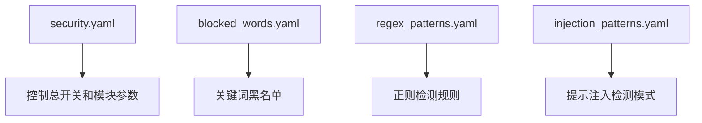

# SRW DeepSeek 本地桌面网关安全配置说明

## 1. 目录说明

本目录包含网关的安全过滤配置文件。所有说明文件均使用 Markdown，安全规则文件使用 YAML。



| 文件 | 用途 |
|:---|:---|
| security.yaml | 主配置文件，控制安全过滤总开关和各模块参数 |
| blocked_words.yaml | 关键词黑名单，定义需要拦截或记录的关键词 |
| regex_patterns.yaml | 自定义正则表达式检测规则 |
| injection_patterns.yaml | 提示词注入攻击检测模式（第二期功能） |

## 2. 如何编辑配置

1. 用文本编辑器打开对应的 `.yaml` 文件。
2. 按照文件中的注释格式添加或修改规则。
3. 保存文件。
4. 在 GUI 的“安全过滤”页点击刷新查看当前加载状态。
5. 重启网关使新配置生效。

## 3. 关键词规则格式

`blocked_words.yaml` 中每条规则包含：

| 字段 | 说明 |
|:---|:---|
| `keyword` | 要匹配的关键词，大小写不敏感 |
| `action` | `BLOCK`、`MASK`、`LOG` |
| `description` | 规则说明 |

示例：

```yaml
- keyword: "国家秘密"
  action: BLOCK
  description: "国家秘密保护-核心涉密表述"
```

## 4. 正则规则格式

`regex_patterns.yaml` 中每条规则包含：

| 字段 | 说明 |
|:---|:---|
| `pattern` | Python 正则表达式 |
| `pattern_name` | 规则名称，用于日志标识 |
| `action` | `BLOCK`、`MASK`、`LOG` |
| `description` | 规则说明 |

> 说明：当前实现严格使用 LiteLLM 原生 `ContentFilterGuardrail`。它对关键词和 regex 的动作只原生支持 `BLOCK` 与 `MASK`。
> 因此配置文件里的 `LOG` 规则会作为源配置保留，但不会被注入 LiteLLM runtime。

示例：

```yaml
- pattern: '\\b1[3-9]\\d{9}\\b'
  pattern_name: cn_phone
  action: MASK
  description: "中国手机号-脱敏"
```

## 5. 为什么默认不启用手机号和邮箱脱敏

本软件运行在本地电脑上，默认安全目标是阻断：

- 明确的国家秘密相关内容
- 明文凭证与 API Key 泄露

手机号、邮箱这类普通联系方式只有在用户主动写进提示词时，网关才会看到。它们不是这个产品的默认核心保密对象，因此默认配置里 `pii_masking.enabled=false`。

如果你的单位要求任何联系方式都不能发到上游模型，可以手动打开该能力。

## 6. 为什么默认规则集现在保持极简

本软件的主要使用场景是 VS Code / Copilot 编程请求转发，因此很多请求天然会包含：

- `exec(`
- `eval(`
- `subprocess`
- `os.system`
- `/bin/bash`
- `cmd.exe`

如果把这些字符串直接作为全局 `BLOCK` 关键词，会高概率误拦正常的代码解释、重构、修复和问答请求。

因此默认策略采取的是：

- **保留**高确定性的国家秘密相关标记：如 `国家秘密`、`绝密`、`机密`、`涉密`
- **保留**高确定性的泄露信号：如明文 `password=`、OpenAI `sk-...` API Key
- **移除**军事敏感、提示注入、有害内容、攻击载荷等宽泛默认关键词

如果你的单位希望恢复更强的分类拦截，可以在 `blocked_words.yaml` 或 `regex_patterns.yaml` 中按需补充。

## 7. 配置生效方式

- 修改配置文件后，需要重启网关才能生效。
- 配置文件缺失或格式错误时，安全过滤会自动禁用，网关仍可正常运行。

## 8. 注意事项

- 关键词匹配不区分大小写。
- `BLOCK` 会直接拒绝请求。
- `MASK` 会将匹配内容替换为掩码。
- `LOG` 不干预请求，只记录到安全审计日志。
- 建议先验证规则效果，再用于正式环境。